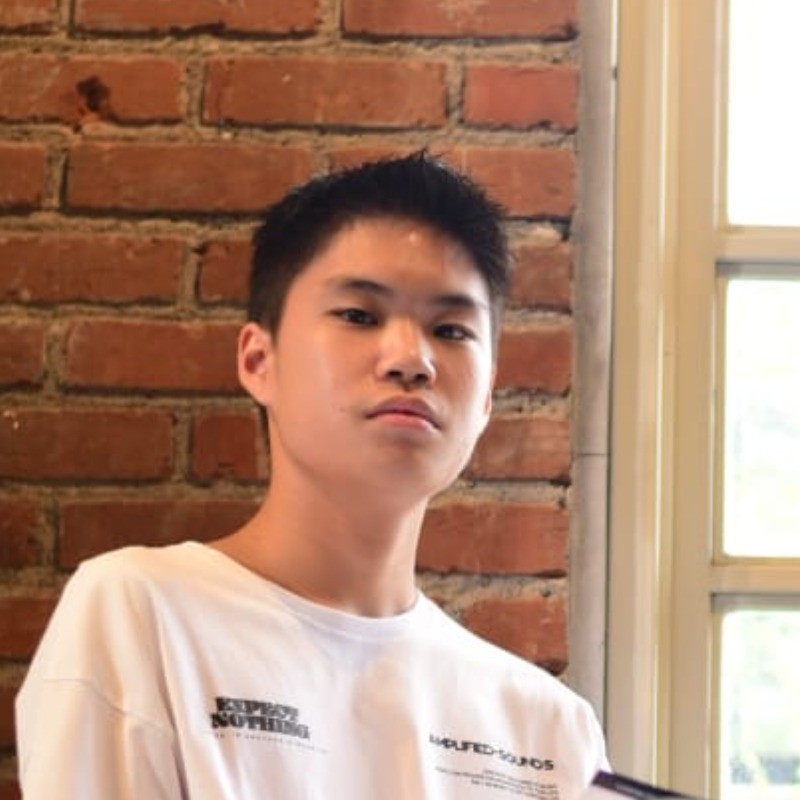

# Clayton Website

This is a simple static personal website for Clayton Lie.

## Files

- `index.html` — Home page
- `blog.html` — Blog page placeholder
- `style.css` — Website styling
- `assets/profile-placeholder.svg` — Temporary profile image

## How to use

1. Open `index.html` in your browser.
2. Replace `assets/profile-placeholder.svg` with your real profile photo.
3. If your image is named `profile.jpg`, update this line in `index.html`:

```html

```

to:

```html

```
